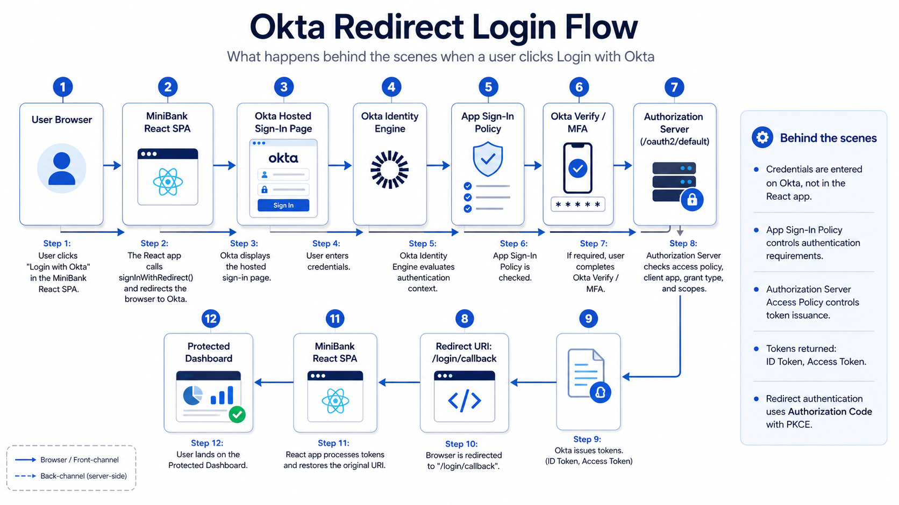

# Okta React Redirect Authentication Demo

This guide explains how to configure the Okta side for a simple React Single-Page Application using **Redirect Authentication**.

In this model, the React app does **not** collect the user's password. Instead, the app redirects the user to the Okta-hosted sign-in page. Okta handles authentication, MFA, policies, and token issuance, then redirects the user back to the React app.

---

## Architecture

```text
React App
   ↓
User clicks "Login with Okta Redirect"
   ↓
Browser redirects to Okta-hosted sign-in page
   ↓
Okta authenticates the user
   ↓
Okta evaluates app sign-in policy
   ↓
Okta evaluates authorization server access policy
   ↓
Okta redirects back to React callback URL
   ↓
React app loads protected dashboard
```

Flow 



---

## Prerequisites

Before starting, make sure you have:

- Access to an Okta Developer / Integrator Free Plan org
- Admin access to the Okta Admin Console
- A React app running locally on:

```text
http://localhost:5173
```

- A callback route in React:

```text
http://localhost:5173/login/callback
```

---

## Step 1: Create an OIDC App Integration

In the Okta Admin Console, go to:

```text
Applications → Applications → Create App Integration
```

Choose:

```text
Sign-in method: OIDC - OpenID Connect
Application type: Single-Page Application
```

Click **Next**.

---

## Step 2: Configure the SPA App

Use a clear app name:

```text
MiniBank React Redirect Demo
```

For grant type, enable:

```text
Authorization Code
```

For a React SPA, Okta uses Authorization Code with PKCE. You do not need a client secret for this demo.

---

## Step 3: Configure Redirect URIs

Set the sign-in redirect URI:

```text
http://localhost:5173/login/callback
```

Set the sign-out redirect URI:

```text
http://localhost:5173
```

These values must exactly match the values used in your React app.

Example React `.env` value:

```env
VITE_OKTA_REDIRECT_URI=http://localhost:5173/login/callback
```

---

## Step 4: Configure Controlled Access

For a simple lab demo, choose:

```text
Allow everyone in your organization to access
```

You can also assign access to a selected group or individual user.

For learning and troubleshooting, direct user assignment or allowing everyone is easier.

---

## Step 5: Copy the Client ID

After saving the app integration, open the app's **General** tab.

Copy the **Client ID**.

Add it to your React app's `.env` file:

```env
VITE_OKTA_CLIENT_ID=your_client_id_here
```

A React SPA should not use a client secret.

---

## Step 6: Configure the Issuer

Use your Okta domain without the admin subdomain.

Correct format:

```env
VITE_OKTA_ISSUER=https://your-okta-domain/oauth2/default
```

Example:

```env
VITE_OKTA_ISSUER=https://dev-12345678.okta.com/oauth2/default
```

Do not use the admin domain:

```text
https://dev-12345678-admin.okta.com
```

Your final `.env` should look similar to this:

```env
VITE_OKTA_ISSUER=https://dev-12345678.okta.com/oauth2/default
VITE_OKTA_CLIENT_ID=0oaexampleclientid
VITE_OKTA_REDIRECT_URI=http://localhost:5173/login/callback
```

After changing `.env`, restart the React app.

```bash
npm run dev
```

---

## Step 7: Add Localhost as a Trusted Origin

In Okta Admin Console, go to:

```text
Security → API → Trusted Origins → Add Origin
```

Configure:

```text
Name: React Localhost
Origin URL: http://localhost:5173
```

Enable both:

```text
CORS
Redirect
```

Save the trusted origin.

This allows the local React app to interact with Okta during development.

---

## Step 8: Configure App Sign-In Policy

The app sign-in policy controls whether the user can access the application and what authentication requirements apply.

Go to:

```text
Security → Authentication Policies
```

Create or update a policy for the React app.

Example policy:

```text
Policy name:
MiniBank React Demo Policy
```

Create a rule:

```text
Rule name:
Allow MiniBank Demo Users
```

Example rule condition:

```text
IF user is any user
AND group is Everyone
AND device is Any
AND network is Any
```

Example rule action:

```text
THEN allow access
AND require Password + Okta Verify
```

For a basic demo, you can keep the rule simple. The important part is that your test user must match the rule.

---

## Step 9: Configure Authorization Server Access Policy

If your React app uses this issuer:

```env
VITE_OKTA_ISSUER=https://your-okta-domain/oauth2/default
```

then Okta also needs a matching access policy under the `default` authorization server.

Go to:

```text
Security → API → Authorization Servers → default → Access Policies
```

Create a policy:

```text
Policy name:
MiniBank Default Auth Server Policy
```

Assign it to your React SPA client:

```text
Client:
MiniBank React Redirect Demo
```

Then add a rule.

Example rule:

```text
Rule name:
Allow Authorization Code PKCE
```

Configure the rule to allow:

```text
Grant type: Authorization Code
User: Any assigned user
Scopes: openid, profile, email
```

Save the rule.

This policy allows Okta to issue tokens to your React app after successful authentication.

---

## Step 10: Test the Login Flow

Start your React app:

```bash
npm run dev
```

Open:

```text
http://localhost:5173
```

Click:

```text
Login with Okta Redirect
```

Expected flow:

```text
React app
   ↓
Redirects to Okta-hosted sign-in page
   ↓
User signs in
   ↓
Okta prompts for Okta Verify if policy requires it
   ↓
Okta redirects to /login/callback
   ↓
React app loads the protected dashboard
```

---

## Common Errors and Fixes

### Error: You are not allowed to access this app

Meaning:

```text
The user is authenticated, but the app access rule or assignment does not allow them.
```

Fix:

- Assign the user to the app
- Assign a group that contains the user
- Or allow everyone in the organization to access the app
- Check the app sign-in policy rule

---

### Error: no_matching_policy

Meaning:

```text
Okta could not find a matching policy rule for this login or token request.
```

Possible fixes:

- Check the app sign-in policy
- Make sure the user matches the policy rule
- Make sure the rule is active
- Make sure the rule is ordered correctly
- Check the default authorization server access policy
- Make sure Authorization Code grant type is allowed
- Make sure scopes `openid`, `profile`, and `email` are allowed

---

### Error: idx.error.code.no_matching_policy

Meaning:

```text
The Identity Engine flow could not find a matching policy rule.
```

Common cause:

```text
The app sign-in policy or authorization server access policy does not match the user, client, grant type, or scopes.
```

Fix both policy layers:

```text
App Sign-In Policy
Authorization Server Access Policy
```

---

## Important Concept: Two Policy Layers

There are two separate policy checks involved in this demo.

### 1. App Sign-In Policy

This answers:

```text
Can this user authenticate into this app?
```

It controls:

```text
Password requirement
Okta Verify requirement
MFA
Device rules
Network rules
Risk rules
```

### 2. Authorization Server Access Policy

This answers:

```text
Can this app receive tokens from /oauth2/default?
```

It controls:

```text
Client app
Grant type
Scopes
User conditions
Token lifetime
```

For the demo to work, both layers must match.

---

## Final Working Flow

```text
React app
   ↓
User clicks Login with Okta Redirect
   ↓
React redirects to Okta
   ↓
Okta-hosted sign-in page appears
   ↓
User authenticates
   ↓
App sign-in policy matches
   ↓
Okta Verify challenge is completed if required
   ↓
Authorization server access policy matches
   ↓
Okta issues tokens
   ↓
Okta redirects to React callback URL
   ↓
React app shows protected dashboard
```

---

## Demo Explanation

Use this explanation when presenting the project:

```text
In redirect authentication, my React app does not collect the user's password. 
The app redirects the user to Okta, where Okta hosts the sign-in page and handles authentication, MFA, and policy evaluation. 
After successful authentication, Okta redirects the user back to my React app with the authorization result, and the app loads the protected dashboard.
```

---

## Recommended Lab Settings

For a first working demo, use:

```text
Application type: Single-Page Application
Grant type: Authorization Code
Redirect URI: http://localhost:5173/login/callback
Logout URI: http://localhost:5173
Trusted Origin: http://localhost:5173
Issuer: https://your-okta-domain/oauth2/default
Scopes: openid, profile, email
```

Avoid enabling advanced federation features such as Federation Broker Mode for this basic redirect authentication lab.

---

## Key Takeaway

Redirect authentication means:

```text
Your app sends the user to Okta.
Okta authenticates the user.
Okta sends the user back to your app.
```

This is the recommended starting point for most Okta OIDC integrations because Okta hosts and manages the authentication experience.
